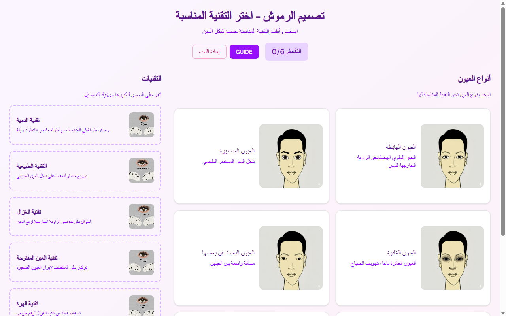

# لعبة تصميم الرموش — Lash Extensions (AR) Slide 5

**Course:** Lash Extensions (AR)  
**Slide:** 5  
**Live URL:** https://ndsj.edtechiecorp.com  
**Stack:** Next.js · Tailwind CSS · TypeScript · GitHub Pages  

## What this slide does

An Arabic-language interactive lash design game, presenting morphology and lash selection content for Arabic-speaking learners. At slide 5, learners have covered the foundational theory and are applying their knowledge through a game-based activity that reinforces eye shape analysis and lash style selection. The right-to-left layout ensures the experience is fully adapted for Arabic-speaking learners.

## Screenshot

## Usage

This slide is embedded as an iframe inside Coassemble at the live URL above. DNS is managed via Cloudflare (`edtechiecorp.com`). To update the slide, push to the `main` branch — GitHub Actions will rebuild and redeploy automatically.
